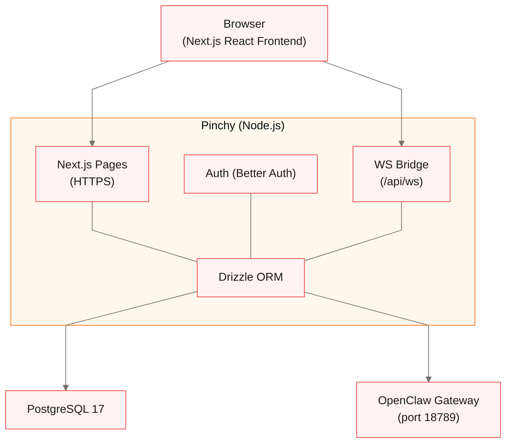

## Overview

Pinchy is **not a fork** of OpenClaw. It's a governance layer on top of it. OpenClaw handles agent execution, tool use, and model communication. Pinchy adds authentication, provider management, agent permissions, cryptographic audit trails, and team management.

## Request flow

When a user sends a message, it flows through three layers:

1. **Browser** → connects via WebSocket to `/api/ws` on Pinchy, sending a JSON message with `type`, `content`, and `agentId`
2. **Pinchy** → authenticates the user, verifies agent access, resolves the **session key** from the in-memory session cache, generates a message ID, and forwards the message to OpenClaw Gateway with the `agentId` and `sessionKey`
3. **OpenClaw** → routes the message to the correct agent from its config, processes it through the configured model, and streams the response back
4. **Pinchy** → attaches the message ID and forwards each chunk to the browser
5. **Browser** → renders the streaming response in real time

Attachments are staged out of band before the chat message is sent: the browser uploads each file via `POST /api/agents/<id>/uploads` and the chat frame carries the returned `attachmentIds` instead of inline base64. Legacy clients that still send inline `image_url` frames are rejected with the error code `PROTOCOL_OUTDATED` rather than forwarded to OpenClaw.

Each browser connection gets its own `ClientRouter` instance that manages agent access checks and session resolution. Pinchy acts as a bridge — it never interprets or modifies the AI response content.

### Agent routing

When a message arrives, the `ClientRouter` passes the `agentId` from the browser message to OpenClaw via `chatOptions`. OpenClaw uses this to select the matching agent from its `agents.list[]` config — each agent can have its own model, system prompt, tools, and workspace.

### Chat sessions

Pinchy derives a deterministic session key for each `(agentId, userId)` pair using the format `agent:<agentId>:direct:<userId>`. This gives each user their own conversation per agent — even for shared agents. Session keys are resolved in-memory via a `SessionCache` that periodically syncs with OpenClaw's session list — no database table is needed. The session key is opaque and never leaves the server — the browser only sends an `agentId`, and Pinchy resolves the session internally.

The browser can request conversation history by sending a `{ type: "history", agentId }` message. Pinchy fetches the history from OpenClaw via `openclaw-node` and strips internal metadata (timestamps, thinking blocks) before returning it.

### Session key naming convention

Session keys follow the format `agent:<agentId>:<scope>`. OpenClaw validates that the `agentId` segment matches the `agentId` parameter passed to `chat()` — a mismatch causes silent failures (history not loaded, messages not sent).

**Current format:**

| Scope             | Key format                        | Example                                  |
| ----------------- | --------------------------------- | ---------------------------------------- |
| Per-user sessions | `agent:<agentId>:direct:<userId>` | `agent:83aa6035-...:direct:8c0953d2-...` |

This format is used for both personal and shared agents. Each user always gets their own session, which means converting a personal agent to a shared agent is seamless — the original user keeps their session, and other users get new ones.

**Planned formats (not yet implemented):**

| Scope            | Key format                      | Example                               | Use case                   |
| ---------------- | ------------------------------- | ------------------------------------- | -------------------------- |
| Cron jobs        | `agent:<agentId>:cron-<jobId>`  | `agent:83aa6035-...:cron-daily-check` | Scheduled agent actions    |
| Webhook triggers | `agent:<agentId>:hook-<hookId>` | `agent:83aa6035-...:hook-slack-alert` | Event-driven agent actions |

The `agentId` segment must always be the Pinchy agent UUID. The `scope` segment is free-form but should follow the patterns above for consistency.

### Connection resilience

The browser-to-Pinchy WebSocket connection includes several layers of protection against network instability:

**Keep-alive heartbeats** — Once the first response chunk arrives, Pinchy sends a `{ type: "thinking" }` message to the browser every 15 seconds for the duration of the request. This defeats browser and proxy idle-timeout disconnects during long pauses between agent turns (e.g. slow local Ollama models running a tool-use loop). Heartbeats are intentionally deferred until the first chunk — starting them earlier would prevent the stuck-request timeout from firing when OpenClaw is unresponsive before it sends anything.

**OpenClaw disconnect propagation** — If Pinchy loses its connection to OpenClaw while a stream is in progress, it immediately closes all active browser WebSockets. This triggers the browser's existing disconnect-recovery path (disconnect error + auto-reconnect) without waiting for the server-side stream to time out. openclaw-node's chat generator hangs indefinitely when OpenClaw disappears, so the close is the only reliable way to surface the error quickly.

**Auto-reconnect with exponential backoff** — If the connection drops, the browser automatically reconnects. Delays start at 1 second and double with each attempt, capped at 5 seconds, up to 10 attempts total. On reconnect, conversation history is re-fetched from the server and any partial streamed message is replaced with the canonical server version.

**Disconnect recovery** — If the WebSocket closes while a response is being streamed, an inline error appears in the chat so the user knows the response may have been interrupted. If OpenClaw finished processing the request before the disconnect, the error is automatically replaced by the complete response when history reloads after reconnect.

**Streaming resume across reconnect** _(v0.5.7)_ — Pinchy maintains a server-side `ActiveRuns` registry keyed by `sessionKey` that tracks every in-flight chat run, including the run's `runId` (OpenClaw-correlated), `startedAt`, current per-turn `messageId`, and the set of currently-connected listener WebSockets. When the browser reconnects, it sends a history request; if a run is in flight for that session, the server adds the new ws to the listener set, includes an `activeRun` signal in the history response, and broadcasts every subsequent chunk to both the original ws (if still alive) and the new one. The client buffers any chunks that arrive on the new ws between the moment the server adds the listener and the moment the history response lands, then drains the buffer after applying the reconciled history — so the in-flight assistant message gains the buffered text without the orphan-bubble flash that used to appear during the reconnect grace window.

**Stuck-request timeout** — If 60 seconds pass without any response activity (no chunks and no thinking heartbeats), the spinner stops and an error is shown prompting the user to send the message again. Heartbeats reset the timer between turns, so a slow-but-alive agent is never killed prematurely.

**Run watchdog** _(v0.5.7)_ — A server-side 30-second interval scans `ActiveRuns` for runs whose absolute age exceeds a per-deployment cap (default 15 minutes, sized for Pinchy's slower-than-cloud workload mix: local Ollama, knowledge-base agents with PDF vision, air-gapped deployments). Stuck runs are aborted via `openclaw-node.chatAbort(sessionKey, runId)`, recorded as a `chat.run_timed_out` audit row, and a terminal error frame is broadcast to any still-connected listener. The watchdog catches runs that the client-side stuck timer can't — closed tabs, backgrounded laptops, and tabs that joined a run via reconnect after the original tab was already closed. A **first-chunk timeout** (default 180 seconds — set above the 150s dispatch-race retry budget so a normal OpenClaw restart isn't mistaken for a hang) covers the complementary failure: a run OpenClaw never acknowledges (no first chunk). Such runs are registered in `ActiveRuns` at dispatch time and, if no first chunk arrives in time, are aborted and broadcast a **retryable** error (audited as `chat.run_no_first_chunk`) so the user can resend instead of waiting on a blank thread — the server-side, reload-surviving backstop to the client's 60-second stuck timer.

**Channel-health watchdog** _(v0.5.7)_ — OpenClaw owns the channel pollers (Telegram, …), so a channel worker that crash-loops _below_ the gateway WebSocket is invisible at the connection level — `connected` stays true and nothing is audited. The classic trigger is a Telegram bot token polled by two deployments: Telegram returns a `getUpdates` 409 conflict and OpenClaw enters a CPU-burning auto-restart loop. A 30-second probe calls `channels.status()`, classifies each account (connected / running / `lastError` / `reconnectAttempts`), and audits the transitions — `channel.degraded` on the first failure, `channel.polling_failed` if it stays down, `channel.recovered` when it comes back. The same status feeds a "Degraded" badge in the agent's Telegram settings.

**Reconnect exhausted** — After 10 failed reconnect attempts, a persistent banner prompts the user to reload the page.

### Session lifecycle and compaction

Sessions grow with each message. OpenClaw tracks the full conversation in JSONL files and sends the relevant context to the LLM provider with each request. Over time, this increases token usage and cost.

OpenClaw handles this via **compaction** — automatic summarization of older messages when the context window approaches its limit. Pinchy relies on OpenClaw's built-in compaction and does not override its mode. It does disable one related feature: OpenClaw's **pre-compaction memory flush** (`agents.defaults.compaction.memoryFlush.enabled: false`). That flush is a separate runtime turn OpenClaw fires right before compacting to salvage unsaved context, but it is hard-wired to the built-in `read`/`write` tools — which Pinchy denies for every agent (workspace writes go through the audited `pinchy_write`). With those tools removed the flush would run with no tools, produce no reply, and consume the user's inbound turn. Pinchy's agents persist memory through `pinchy_write` instead, so the native flush is a redundant, ungoverned duplicate. There is also an explicit `sessions.compact(key, { maxLines })` API for manual compaction.

Sessions track a `compactionCount` to record how many compactions have occurred. The impact on `sessions.history()` output after compaction (whether summaries appear as regular messages or a special type) is an open question that will be addressed when sessions grow large enough to trigger it.

## Authentication

Pinchy uses [Better Auth](https://www.better-auth.com/) with email/password authentication:

- Passwords are hashed with **scrypt** before storage (with **bcrypt** legacy fallback for migrated accounts)
- Sessions are stored in the **database** (server-side session store in PostgreSQL)
- The user's **role** (`admin` or `user`) is managed by the Better Auth Admin Plugin
- The first user created via the setup wizard becomes the admin
- All app routes require authentication — unauthenticated requests redirect to `/login`

### Roles

Pinchy has two roles:

- **Admin** — can manage agents, users, invites, and settings
- **User** — can chat with agents and update their own profile

### Invite system

Admins invite new users by generating an invite token:

1. Admin creates an invite for an email address via **Settings → Users**
2. Pinchy generates a random token, stores its **SHA-256 hash** in the database, and returns the plaintext token as a one-time invite link
3. The invite recipient opens the link, sets their name and password, and their account is created
4. A personal **Smithers** agent is automatically created for the new user
5. Invite tokens expire after **7 days** and are single-use

## Permission layer

Pinchy uses an **allow-list** model for agent permissions: agents have **no tools by default**. Admins explicitly enable tools for each agent via the Permissions tab in Agent Settings.

Tools are organized into two categories:

- **Safe tools** — workspace and approved-directory read access (`pinchy_ls`, `pinchy_read`), plus opt-in web search/fetch (`pinchy_web_search`, `pinchy_web_fetch`). All paths are validated against the agent's allow-list at runtime.
- **Powerful tools** — actions that change state outside the conversation: `pinchy_write` for workspace writes, and the Odoo / email write tools (`odoo_create`, `odoo_schedule_activity`, `odoo_complete_activity`, `odoo_reschedule_activity`, `odoo_confirm_order`, `odoo_apply_inventory`, `odoo_validate_picking`, `odoo_mark_mo_done`, `odoo_set_approval`, `odoo_write`, `odoo_attach_file`, `odoo_delete`, `email_draft`, `email_send`). Pinchy does not expose a shell-execution tool or an unrestricted "read any file" tool; OpenClaw's native filesystem and shell groups are explicitly denied at config-generation time.

When an agent has safe tools enabled, the `pinchy-files` plugin validates every file access request against the agent's allowed directories, with symlink resolution to prevent escapes.

In addition to the allow-list, every agent has built-in PDF and image readers that are **scoped to its own [workspace](/concepts/workspaces/)** — they cannot reach files outside the workspace, regardless of permissions. Each workspace has two subdirectories: `uploads/` (files the user attached in chat) and `workbench/` (the agent's writable area for `pinchy_write` deliverables). Both are created eagerly on workspace spawn, so a fresh agent can save files immediately without needing a prior user upload.

Smithers agents also use the `pinchy-context` plugin, which provides `pinchy_save_user_context` and `pinchy_save_org_context` tools. These tools call Pinchy's internal API (authenticated via a shared gateway token) to save context from the onboarding interview directly to the database and sync it to agent workspaces.

All agent-accessible files live under `/data/` in the container, mounted via Docker volumes. This means even if all software layers failed, the agent can only see files that were explicitly mounted.

### Agent access control

Pinchy restricts which agents a user can see:

- **Admins** can access all agents (personal and shared)
- **Users** can access shared agents and their own personal agent
- Only admins can view and modify agent permissions

For the full details, see [Agent Permissions](/concepts/agent-permissions/).

## Database

PostgreSQL 17, accessed via [Drizzle ORM](https://orm.drizzle.team/). The schema includes:

- **Auth tables** — `user`, `account`, `session`, `verification` (managed by Better Auth)
- **`agents`** — Agent configuration (name, model, template, allowed tools, plugin config, owner)
- **`invites`** — Invite tokens (SHA-256 hashed token, email, expiry, status)
- **`settings`** — Key-value store for app configuration (provider keys, onboarding state)
- **`auditLog`** — Append-only audit trail with HMAC-SHA256 signed rows, protected by PostgreSQL triggers preventing UPDATE and DELETE

Migrations are generated with `drizzle-kit generate` and applied automatically on container startup via `drizzle-kit migrate`.

## Encryption

Provider API keys are encrypted at rest using **AES-256-GCM**:

- A 256-bit encryption key is either provided via the `ENCRYPTION_KEY` environment variable or auto-generated and persisted in the `pinchy-secrets` Docker volume
- Each encrypted value stores the IV, auth tag, and ciphertext together
- Decryption happens on-demand when Pinchy writes the OpenClaw configuration file

## Audit Trail

Pinchy includes a cryptographic audit trail for compliance and security. Every significant action is logged to the `auditLog` table with an HMAC-SHA256 signature.

### Design principles

- **Append-only** — PostgreSQL triggers prevent UPDATE and DELETE operations on audit rows. Once written, entries are immutable.
- **Cryptographically signed** — Each row is signed with HMAC-SHA256 using a server-side secret (auto-generated if not provided via `AUDIT_HMAC_SECRET`).
- **Fire-and-forget** — Audit logging never blocks or breaks the main operation. If logging fails, the original action still succeeds.
- **Admin-only access** — Only admins can view, verify, or export the audit log.

### What gets logged

Pinchy logs events across eight families: authentication (including `auth.password_reset_completed` and `auth.csrf_blocked`), agent management, chat runtime (every tool call plus error events like `chat.agent_error` — an umbrella that fires for every failure shape so a single query covers the long tail), user management, group management, channel management, configuration changes, and attachments (`file.upload.staged`, `file.upload.attached`, `file.upload.expired`). Chat message content is **not** logged — only tool calls, permission-relevant actions, and structured error metadata. See [Audit Trail](/concepts/audit-trail/) for the complete list of event types.

### Integrity verification

Admins can verify the integrity of audit entries via the admin UI or the `/api/audit/verify` endpoint. Verification recomputes HMAC signatures and reports any tampered rows.

### CSV export

The audit log can be exported as CSV for compliance reporting via the admin UI or the `/api/audit/export` endpoint.

For the full details, see [Audit Trail](/concepts/audit-trail/).

## OpenClaw integration

OpenClaw runs as a separate Docker container. Pinchy communicates with it via `openclaw-node` (the official Node.js client) over WebSocket on port 18789. The browser never connects to OpenClaw directly.

The current pin pair is **`openclaw@2026.6.5`** in `Dockerfile.openclaw` and **`openclaw-node@0.12.1`** as a Pinchy dependency, which together advertise protocol v4 on the gateway handshake. Earlier OpenClaw versions ran protocol v3; the v4 cut-over is permanent from OpenClaw 2026.5.12 onward.

### Config generation

Pinchy owns the OpenClaw configuration file (`openclaw.json`). A single function, `regenerateOpenClawConfig()`, handles every write — from the first config during setup to every subsequent change when agents, permissions, or providers are modified. It rebuilds the config from current database state, preserving only the `gateway` block (auth token and OpenClaw-generated fields).

Pinchy also unconditionally overrides OpenClaw's default `session.reset = { mode: "daily", atHour: 4 }` with an idle-based reset (`mode: "idle", idleMinutes: 525600`), so chat history doesn't disappear at 4 AM when the gateway rotates the session pointer. The override is reapplied on every regeneration.

Because the database is the source of truth, regeneration is **idempotent** and self-healing: deleted providers and agents are cleaned up automatically, and calling it twice produces the same file. To avoid unnecessary restarts, Pinchy short-circuits the write when the new content is identical to what's already on disk.

An inotify-based wrapper script inside the OpenClaw container detects config file changes and restarts the gateway automatically, with a 30-second grace period between restarts to prevent restart loops.

### Gateway-auth bootstrap

OpenClaw 2026.5.12+ refuses to bind on a non-loopback interface without a `gateway.auth.token` in `openclaw.json`. Earlier versions self-bootstrapped a random token on first start; the new behaviour leaves a fresh install stuck if no upstream writer ever lands a token. Pinchy seeds `gateway.auth.{mode: "token", token}` into `openclaw.json` _before_ the OpenClaw container starts (via `boot-inits.ts` running ahead of the setup wizard), so the first boot always has a valid auth bootstrap and the wizard's later `regenerateOpenClawConfig()` doesn't change the auth-mode shape — which would otherwise trigger an OpenClaw restart that drops lazy plugins from the runtime.

### Authentication

Pinchy authenticates to OpenClaw Gateway using a bearer token. The token is auto-generated on first setup via `crypto.randomBytes(24)` and stored in the `gateway.auth` block of `openclaw.json`. It never appears in source control.

### Volume layout and the `workspaces/` subtree

Two Docker volumes back the OpenClaw integration, and the boundary between them matters:

- **`openclaw-config`** holds OpenClaw's core state: `openclaw.json`, `secrets.json`, the session transcripts, and the memory SQLite index. It is mounted at `/openclaw-config` in the Pinchy container and `/root/.openclaw` in the OpenClaw container.
- **`pinchy-workspaces`** holds per-agent workspace content (identity, instructions, `uploads/`, `workbench/`, and agent memory). It is mounted _into_ the OpenClaw config tree at the `workspaces/` subpath — `/openclaw-config/workspaces` for Pinchy and `/root/.openclaw/workspaces` for OpenClaw.

A Pinchy agent's files therefore live at `workspaces/<agentId>/`, **not** under OpenClaw's native `agents/<name>/` tree. This is deliberate: it gives agent-owned content its own backup/lifecycle boundary, and it namespaces UUID-keyed Pinchy agents away from any OpenClaw-native agents created through the CLI. OpenClaw resolves each agent's `MEMORY.md` and `memory/` files _relative to_ its configured `workspace` — i.e. `workspaces/<agentId>/MEMORY.md`.

Because the same volume is mounted at two different paths, two helpers in `lib/workspace.ts` are the single source of truth: `getWorkspacePath()` (Pinchy-side, for direct file I/O) and `getOpenClawWorkspacePath()` (the OpenClaw-side path written into `agents[].workspace`). Any code that watches or derives an agent's on-disk location must use these helpers; hardcoding `agents/` or `workspaces/` elsewhere is the drift that left the memory-audit watcher silently inert (issue #345).

## Channels

Users don't have to reach their agents through the web UI. Pinchy supports external **channels** that connect agents to messaging platforms. Telegram is the first implemented channel; additional channels (email, Slack) are planned.

### Per-agent bots

Each agent can be connected to its own Telegram bot via **Agent Settings → Telegram**. The main Pinchy bot (the Smithers bot) is set up once globally via **Settings → Telegram** and acts as the entry point for user account linking. Additional agent bots require the main bot to be configured first — users link their Telegram account via the main bot and then gain access to any bot they have permission to use.

### Identity linking

Users link their Telegram account to their Pinchy account via a one-time pairing code: the user messages the bot, receives a code, and enters it in Pinchy. The link is stored in the `identityLinks` table. All inbound Telegram messages are resolved to the linked Pinchy user before being routed to the agent — so the agent always knows who it's talking to.

### Session unification

Messages from Telegram and the web UI flow through the same session cache using the same `agent:<agentId>:direct:<userId>` key format. This means switching channels doesn't fork conversation history — a user who chats with an agent on the web and then messages it on Telegram sees the combined conversation.

### Config propagation

Telegram bot tokens and channel settings live in the database as the source of truth. Changes trigger a `regenerateOpenClawConfig()` write, and OpenClaw picks up the new config via the file watcher. There's no WebSocket RPC for channel configuration — the config file is the contract.

For the user-facing setup, see [Set Up Telegram](/guides/telegram-setup/).

## Integrations

Integrations let agents work with external business data — email accounts, ERPs, search engines — without giving them direct system access. Each integration is a connection stored in the database, referenced by agents via per-agent permissions.

| Integration    | Connection method | Stored credentials            |
| -------------- | ----------------- | ----------------------------- |
| **Gmail**      | OAuth 2.0         | Access token + refresh token  |
| **Odoo**       | API key           | URL, database, login, API key |
| **Web Search** | API key           | Brave Search API key          |

All credentials are encrypted at rest with AES-256-GCM and isolated per-row: a single decryption failure no longer hides every integration. Credentials never reach the OpenClaw config file — plugins fetch them on-demand via Pinchy's internal API, authenticated with the shared gateway token.

Each integration enforces its own permission model on the agent side:

- **Gmail** — checkbox-based permissions (Read / Create drafts / Send) map to specific tool IDs
- **Odoo** — access levels (Read-only / Read & Write / Full / Custom) with optional per-model restrictions
- **Web Search** — tool checkboxes plus per-agent filters (Domain allow/deny, Freshness, Language, Region)

For the conceptual overview, see [Integrations](/concepts/integrations/). For per-integration setup, see the guides: [Connect Email](/guides/connect-email/), [Connect Odoo](/guides/connect-odoo/), [Set Up Web Search](/guides/web-search-setup/).

## Domain lock and insecure mode

Pinchy's security profile is controlled by a single runtime setting: the locked domain. When a domain is locked via **Settings → Security**, Pinchy:

- Rejects requests whose `Host` header doesn't match the locked domain (`403 Access Denied`)
- Issues cookies with `Secure` and `SameSite=Lax`
- Advertises HSTS
- Enforces origin checks on state-changing requests

When unlocked, Pinchy shows an insecure-mode warning banner to admins in the UI. This flips security-relevant middleware off as a package — convenient for local development, unsafe for production. A `docker exec pinchy pnpm domain:reset` CLI recovers access if HTTPS goes down after a lock. See [HTTPS & Domain Lock](/guides/domain-lock/) for the full flow.

## Tech stack

| Layer         | Technology                                       |
| ------------- | ------------------------------------------------ |
| Frontend      | Next.js 16, React 19, Tailwind CSS v4, shadcn/ui |
| Chat UI       | assistant-ui (React)                             |
| Auth          | Better Auth (email/password, DB sessions)        |
| Database      | PostgreSQL 17, Drizzle ORM                       |
| Agent runtime | OpenClaw Gateway (WebSocket)                     |
| Encryption    | AES-256-GCM (Node.js crypto)                     |
| Testing       | Vitest, React Testing Library, Playwright (E2E)  |
| CI/CD         | GitHub Actions, ESLint, Prettier                 |
| Deployment    | Docker Compose, pre-built images on GHCR         |
| Reverse proxy | Caddy (recommended) or nginx                     |
| SBOM          | Syft via `anchore/sbom-action`                   |
| License       | AGPL-3.0                                         |
